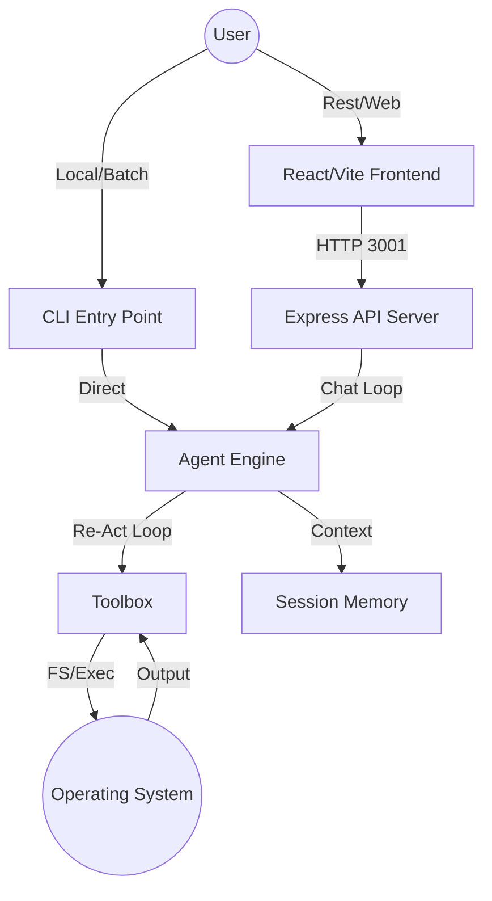

# SimpleClaw System Architecture (v1.2.0) 🏛️

SimpleClaw is architected for **Self-Evolution** and **Portability**. This document provides a high-level overview of how the components interact.

## 📡 The Big Picture

## 📂 Module Responsibility
- **`src/system.ts`**: The Singleton "Brain Stem". Handles configuration (`config.json`), global secrets (`env/*.txt`), and model auto-discovery across providers.
- **`src/agent.ts`**: The "Cerebral Cortex". Manages the Re-Act autonomous loop, memory compaction (Every 5 turns), and session summarization.
- **`src/toolbox.ts`**: The "Motor Cortex". Handles code execution, file i/o, and automatic tool discovery in the `tools/` directory.
- **`src/llm.ts`**: The "Communication Layer". Abstratcs OpenAI, OpenRouter, and Ollama APIs into a single `chat()` interface with built-in failover.

## 🧱 The LEGO Protocol
The architecture is inherently modular. Instead of a monolithic system prompt, SimpleClaw uses **Instruction Bricks** (LEGOs):
- **Core Persona**: Foundational identity.
- **Toolbox**: Dynamic list of tool capabilities.
- **Project Map**: High-level file structure (loaded on-demand).
- **Protocols**: Advanced dev-rules (loaded on-demand).

## 💾 Storage Conventions
- **`config.json`**: Global operational settings (Models, Modes, Security).
- **`env/`**: Plain-text API keys (e.g., `openai.txt`, `ollama.txt`).
- **`storage/sessions/`**: Archived conversation summaries and token usage logs.
- **`tools/`**: Persistent JS scripts.
- **`tools/temp/`**: Session-specific ephemeral tools.

## 🚥 Request Handling
The system processes chat requests **Sequentially**. Each POST to `/api/chat` triggers a full autonomous cycle. The response is only returned once the Agent decides the task is "Done" or hits its step limit.
